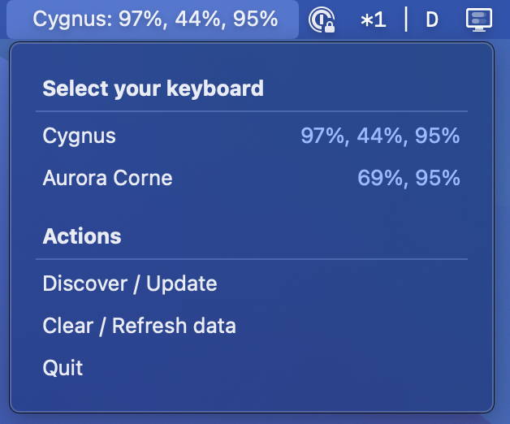

### Zmk Util
Makes battery levels of all parts (all splits) of you zmk split keyboard easily visible in the macOs menu bar
### Preview
This is a screenshot of how the menu looks once enabled

### Features
- Show a list of connected devices / keyboards that report battery status
- Select keyboard from said list, whose battery status will then be displayes in the menu battery
- Reactive updates of battery status
- Refetch the list of connected devices (also done automatically every 120 seconds)
- Clear the list of battery reports, if there were to be any issues

### Todos
- [ ] Package the app
- [ ] Add some more customization options eg. connnected devices refresh times

### Notes
- this tools was put together in a few hours on the weekend, if you find any issues or have suggestions please feel free to open an issue

