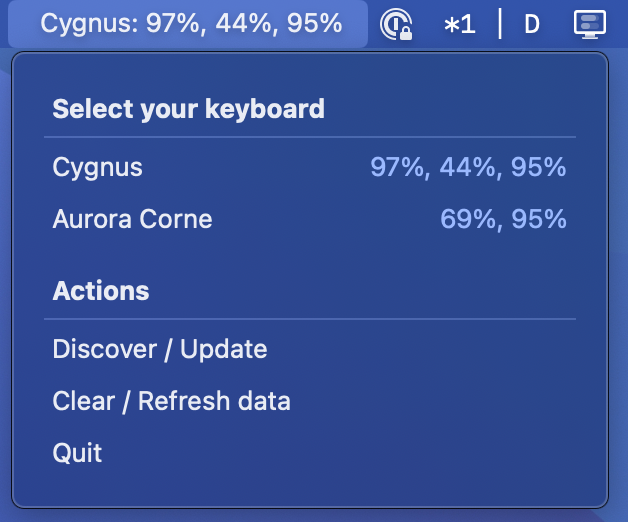

## Zmk Util
Makes battery levels of all parts (all splits) of your zmk split keyboard easily visible in the macOs menu bar
### Preview
This is a screenshot of how the menu looks once enabled


### Features
- Show a list of connected devices / keyboards that report battery status
- Select keyboard from said list, whose battery status will then be displayes in the menu battery
- Live updates of battery status in the menu bar
- Refetch the list of connected devices (also done automatically every 120 seconds)
- Clear the list of battery reports, if there were to be any issues


### Todos
- [ ] Package the app
- [ ] Add some more customization options eg. connnected devices refresh times


### Installation
1. Go to this repo's release page and download the latest version
2. Double clicke the downloaded bundle and drag it to you application folder


### Building the app bundle from source for testing
1. run xcodegen
```bash
xcodegen
```
2. Build the app with xcodebuild
```bash
xcodebuild \
  -project ZMKBatteryUtil.xcodeproj \
  -scheme ZMKBatteryUtil \
  -configuration Release \
  -derivedDataPath build/DerivedData \
  CODE_SIGNING_ALLOWED=NO \
  CODE_SIGNING_REQUIRED=NO \
  build
```
3. Locate the .app bundle at "build/DerivedData/Build/Products/Release/ZMKBatteryUtil.app"

### Notes
- this tools was put together in a few hours on the weekend ( with little swift experience ), if you find any issues or have suggestions please feel free to open an issue

